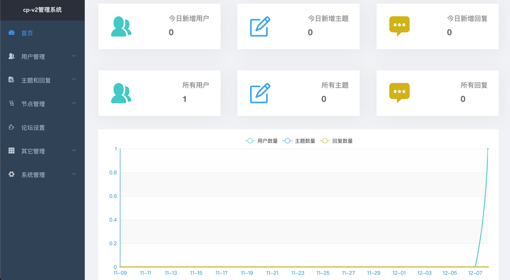
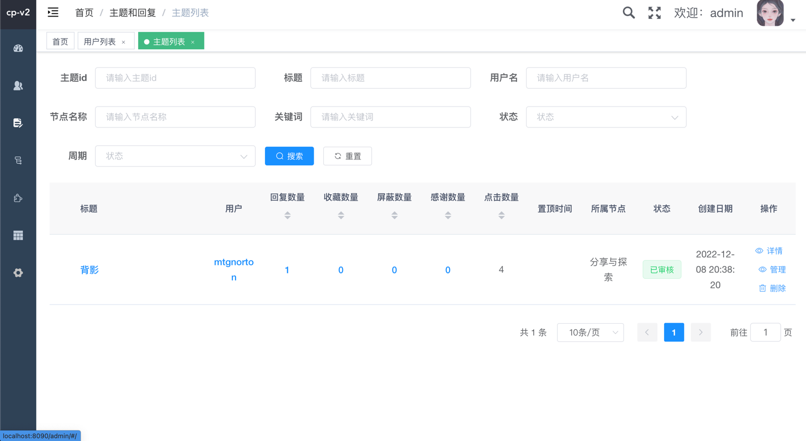
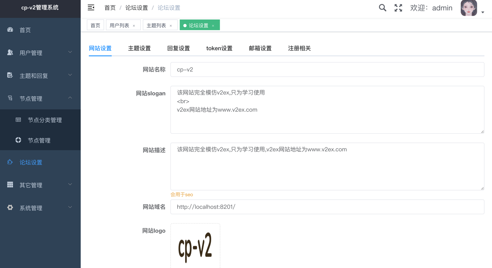
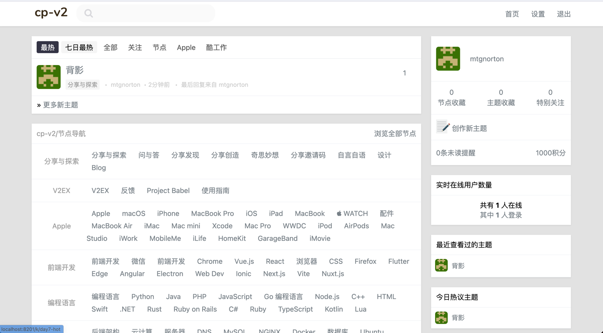
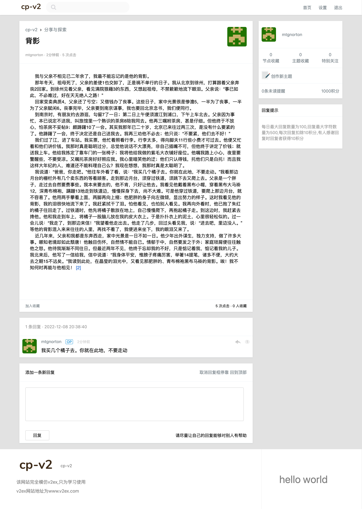
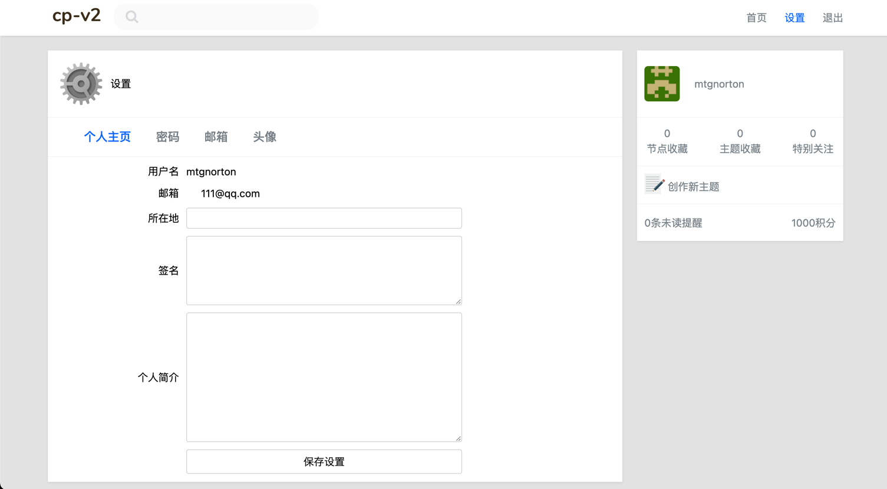
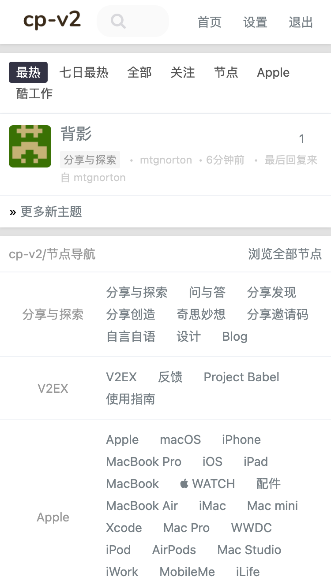
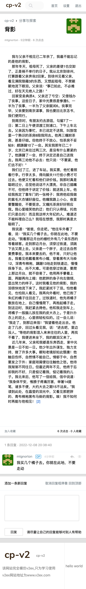
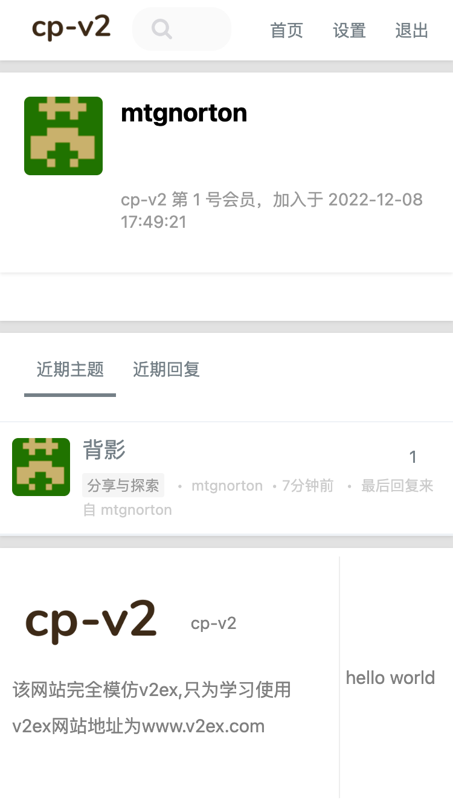

## 内容列表

- [介绍](#介绍)
- [技术栈和依赖](#技术栈和依赖)
- [目录介绍](#目录介绍)
- [安装和运行](#安装和运行)
- [项目截图](#项目截图)

- [相关仓库](#相关仓库)

## 介绍

该项目相当于一个简单版的v2ex,用户端界面完全模仿[v2ex](https://www.v2ex.com),用户端模板设计版权归[livid](https://www.v2ex.com/member/livid)
所有,该论坛完成了基本的论坛功能， 用户端页面自适应,演示地址 http://cp-v2.mtgnorton.xyz/k/all

#### 论坛主要功能

1. 邮箱注册和登录
2. 创建主题和回复
3. 基于cfa的敏感词过滤
4. 关注｜屏蔽|感谢 用户|主题|回复
5. 收藏主题
6. 消息提醒
7. 个人中心
8. 积分系统
9. 无限层节点
10. seo友好
11. 主题和回复搜索
12. 实时在线用户
13. 主题置顶

#### 后台基础功能

1. 基础cabin实现的的rabc权限管理
2. 管理员管理，角色管理
3. 动态菜单和路由
4. 管理员操作日志

后续会继续进行完善

## 技术栈和依赖

后端语言为golang,框架为goframe2.0,后台为前后端分离，前端使用vue2.6+element,前台为传统的模版渲染，前台全局只依赖jquery,前后台富文本编辑器均使用quill,数据库使用mysql,关于项目的模块化设计参见:https://goframe.org/pages/viewpage.action?pageId=3672891

## 目录介绍

```azure
app
├── dao
├── dto
├── model 全局定义层
├── shared 全局service层
├── system 
    ├── admin 后台模块
        ├── controller 后台控制器层 
        ├── define 后台定义层
        ├── service 后台服务层
        
    ├── index 前台模块
        ├── controller 前台控制器层
        ├── define 前台定义层
        ├── service 前台服务层
assist
    ├── generate_dao.go 生成dao层,entity层,dto层 代码
config 配置文件目录
docker docker部署目录
public 静态资源目录和web根目录
runtime 运行时目录
temp 编译后的文件存放目录
template 
    ├── admin 后台模板目录
    ├── index 前台模板目录
utility 工具函数目录    
compile-front.sh 将后台前端打包后的文件复制到public目录
docker-build.sh 将项目打包成docker镜像    
```    


## 安装和运行
选择配置文件,共有local,dev,prod 三个配置文件,分别对应本地开发,开发环境,生产环境,默认为local
如选择prod,有两种方式,环境变量方式 `export V2_ENV=prod;./main` 或者命令行参数方式 `./main -v2.env=prod`

1. 源码运行
   - 本地环境要求:go,mysql,redis
   - `git clone github.com/mtgnorton/cp-v2`
   - 将`docker/sql/structure_and_data.sql`导入mysql,然后修改config/config-local.toml中的相关配置
   - `cd vp-v2`
   - `go mod init`
   - `go run main.go` 或`gf run main.go`此时需要安装goframe框架的gf命令,gf命令可以自动编译运行
2. 普通运行
   - 本地环境要求:mysql,redis
   - `git clone github.com/mtgnorton/cp-v2`
   - 将`docker/sql/structure_and_data.sql`导入mysql,然后修改config/config-local.toml中的相关配置
   - temp目录下有编译好的二进制文件,另外需要config目录和public目录,将main，config目录和public目录放在同一目录下
   - 最后执行`./main` 
3. docker运行
   - 需要docker compose 版本大于等于2
   - `git clone github.com/mtgnorton/cp-v2`
   - `cd docker`
   - `docker-compose up`启动,`docker/data`为运行时的目录

## 项目截图
### 后台



### 前台pc端



### 前台h5端



## 相关仓库
后台前端vue项目地址: https://github.com/mtgnorton/cp-v2-admin-ui
